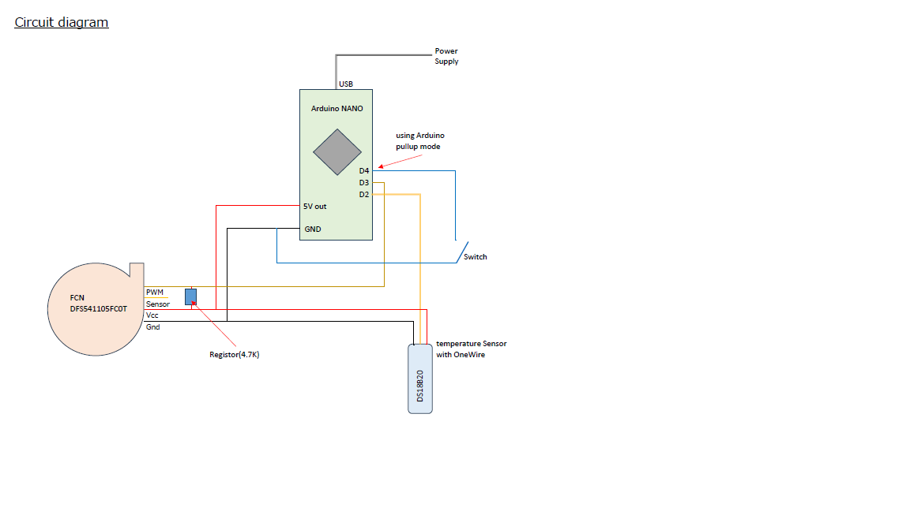

# AquariumWaterTemperatureController2
This program read temperature from DS18B20 and controls FAN FCN DFS541105FC0T
in order to keep aquarium water temperature lower than some threashold.
This program is running on Arduino NANO.
---

---

---

